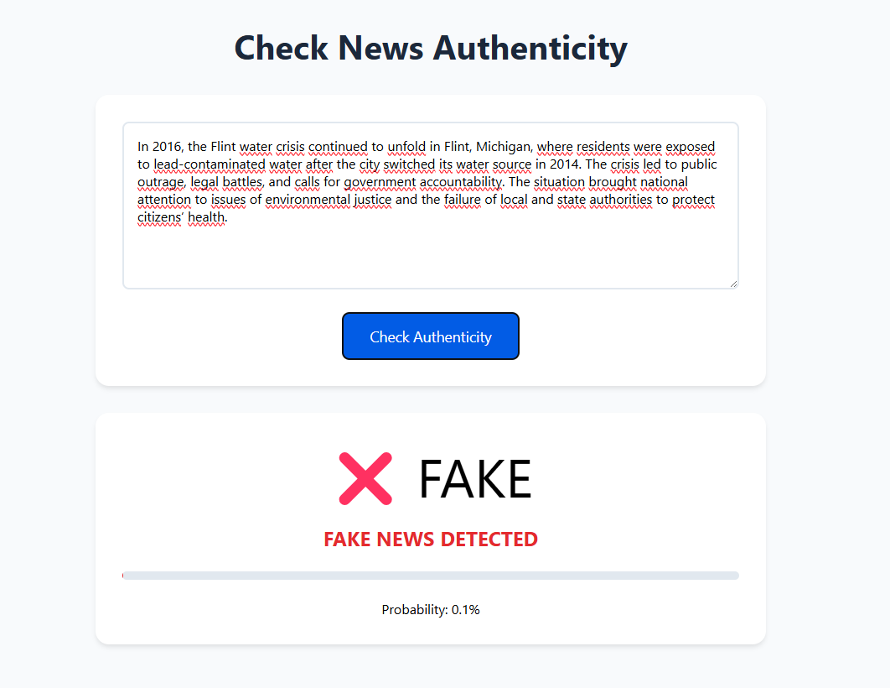

# 📰 Fake News Detection Model

## 🌟 Opis projektu | Project Description

🇵🇱 Model uczenia maszynowego do wykrywania fake newsów, zbudowany przy użyciu TensorFlow. Zawiera model, serwer API oraz prosty interfejs użytkownika, który umożliwia przewidywanie na podstawie wprowadzonych tekstów.

🇬🇧 A machine learning model for detecting fake news, built using TensorFlow. It includes a model, an API server, and a simple user interface that allows users to make predictions based on input text.

---

## 📂 Struktura projektu | Project Structure

```
FakeNewsDetection/
├── model/                # 📦 Model ML
│   ├── FakeNewsModel.ipynb  # 🧪 Notebook do treningu
│   ├── model.keras          # 🎯 Wytrenowany model
│   ├── tokenizer.json       # 🏷 Tokenizer dla NLP
│   ├── data/                # 📊 Zbiór danych
│   │   ├── Fake.csv         # ❌ Fake newsy
│   │   ├── True.csv         # ✅ Prawdziwe newsy
│
├── server/               # 🚀 Backend API (FastAPI)
│   ├── main.py           # 🖥 Główny serwer API
│   ├── model.keras       # 🎯 Załadowany model do predykcji
│   ├── tokenizer.json    # 🏷 Tokenizer
│
├── UI/                   # 🎨 Interfejs użytkownika
│   ├── app.js            # ⚡ Logika aplikacji
│   ├── index.html        # 📄 Frontend HTML
│   ├── styles.css        # 🎨 Stylizacja UI
│
├── screen1.png              # 📸 Zrzuty ekranu aplikacji
├── screen2.png
├── requirements.txt

```

---

## 📥 Pobieranie danych | Downloading the Dataset

### 🇵🇱 Po polsku:
Aby poprawnie uruchomić model, pobierz dane z Kaggle:

🔗 [Fake News Detection Dataset](https://www.kaggle.com/datasets/emineyetm/fake-news-detection-datasets)

Po pobraniu plików **Fake.csv** i **True.csv**, umieść je w folderze:
```
model/data/
```

### 🇬🇧 In English:
To properly run the model, download the dataset from Kaggle:

🔗 [Fake News Detection Dataset](https://www.kaggle.com/datasets/emineyetm/fake-news-detection-datasets)

After downloading **Fake.csv** and **True.csv**, place them in the folder:
```
model/data/
```

---

## 📥 Klonowanie repozytorium | Cloning the Repository

### 🇵🇱 Po polsku:

```bash
git clone https://github.com/user/FakeNewsDetection.git
cd FakeNewsDetection
```

### 🇬🇧 In English:

```bash
git clone https://github.com/user/FakeNewsDetection.git
cd FakeNewsDetection
```

---

## 🚀 Uruchamianie projektu | Running the Project

### 1️⃣ Instalacja zależności | Install dependencies

```bash
pip install -r requirements.txt
```

### 2️⃣ Uruchom serwer API | Start the API server

```bash
cd server
python main.py
```

API zostanie uruchomione pod adresem `http://localhost:8000`

### 3️⃣ Uruchom UI (Serwer HTTP) | Start the UI (HTTP Server)

```bash
cd UI
python -m http.server 3000
```

🔗 **Dostęp do aplikacji:** Otwórz [http://localhost:3000](http://localhost:3000) w przeglądarce.

### 📸 Podgląd aplikacji | Screenshots



---

## 📌 Wymagania | Requirements

✅ Python 3.8+
✅ TensorFlow
✅ FastAPI
✅ Pandas, NLTK, NumPy
✅ HTML, CSS, JavaScript (dla UI)

---

## 📜 Licencja | License

MIT License © 2025 Fake News Detection Team 🛠

